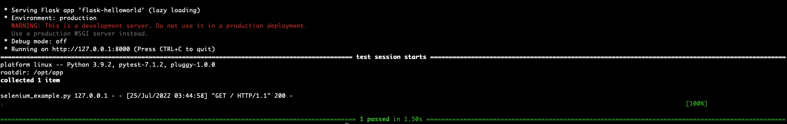

# selenium-docker-github-actions-demo

## Run locally

```
docker build -t selenium-docker-github-actions-demo .
```

```
docker run -it selenium-docker-github-actions-demo:latest
```



## Run on Github Actions


## References

https://github.com/marketplace/actions/setup-chromedriver
