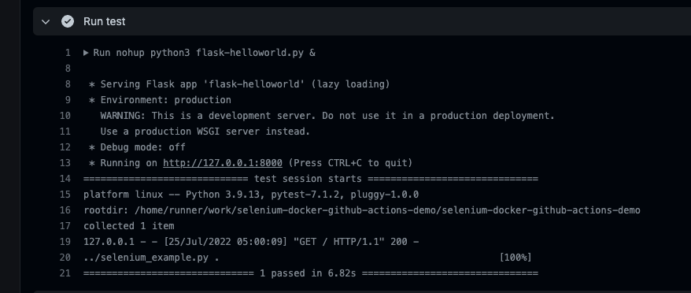

# selenium-docker-github-actions-demo

## Run locally

```
docker build -t selenium-docker-github-actions-demo .
```

```
docker run -it selenium-docker-github-actions-demo:latest
```


## Run on Github Actions

By including the `hello-world.yml` workflow definition in this repo, github will run the test defined there just as we did in our local docker container:



Keep in mind, github actions is free for public repos but limited free for private repos, after which you'll have to pay per minute used.

## References

https://github.com/marketplace/actions/setup-chromedriver
